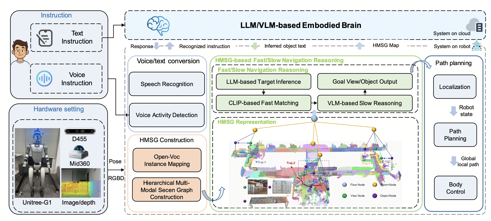

# FSR-VLN
[](https://horizonrobotics.github.io/robot_lab/fsr-vln)
[](https://arxiv.org/abs/2509.13733)
[](https://mp.weixin.qq.com/s/HqnBlTNqOL3Z4Kg8tLHCSw)


This repository is the official implementation of the paper:

> **FSR-VLN: Fast and Slow Reasoning for Vision-Language Navigation with Hierarchical Multi-modal Scene Graph**





## 📔 Introduction
***FSR-VLN*** is a core component of the HoloAgent framework. It provides natural language guided navigation and intelligent interaction for general-purpose robots, and is built on core agent components such as mapping and localization, multimodal perception, decision-making and planning, and memory management. At its core, FSR-VLN is a vision–language navigation system that integrates a Hierarchical Multi-modal Scene Graph (HMSG) for coarse-to-fine environment representation with Fast-to-Slow Navigation Reasoning (FSR), leveraging VLM-driven refinement to enable efficient, real-time, long-range spatial reasoning.


## 🏗 Setup
1. Clone and set up the HoloAgent repository
```bash
git clone https://github.com/HorizonRobotics/HoloAgent.git
cd HoloAgent/fsr_vln/

# set up virtual environment and install habitat-sim afterwards separately to avoid errors.
conda env create -f environment.yaml
conda activate fsrvln
conda install habitat-sim -c conda-forge -c aihabitat

# set up the hmsg python package
pip install -e .
```

### OpenCLIP
FSR-VLN uses the Open CLIP model to extract features from RGB-D frames. To download the Open CLIP model checkpoint `CLIP-ViT-L-14-laion2B-s32B-b82K` please refer to [Open CLIP](https://huggingface.co/laion/CLIP-ViT-L-14-laion2B-s32B-b82K).
```bash
mkdir checkpoints
wget https://huggingface.co/laion/CLIP-ViT-L-14-laion2B-s32B-b82K/resolve/main/open_clip_pytorch_model.bin?download=true -O checkpoints/open_clip_pytorch_model.bin 
```

### SAM
FSR-VLN uses [SAM](https://github.com/facebookresearch/segment-anything) to generate class-agnostic masks for the RGB-D frames. To download the SAM model checkpoint `sam_v2` execute the following:
```bash
wget https://dl.fbaipublicfiles.com/segment_anything/sam_vit_h_4b8939.pth -O checkpoints/sam_vit_h_4b8939.pth
```


## 🖼️ Dataset Preparation
FSR-VLN takes posed RGB-D sequences as input. In order to produce hierarchical multi-story scenes we make use of the Horizon RGBD-datasets 

- Download the [Horizon RGBD-Datasets](https://huggingface.co/datasets/HorizonRobotics/fsrvln_datasets/tree/main) dataset.
```bash
# download and unzip dataset to this directory
mkdir -p /mnt/holoagent/fsrvln/rgbd_datasets/
# after download, unzip the dataset to this directory, for 
cd /mnt/holoagent/fsrvln/rgbd_datasets/
unzip "icra_*.zip" -d /mnt/holoagent/fsrvln/rgbd_datasets/
#- The dataset in this directory contains the following scenes:
#    - icra_sh3f
#    - icra_ic3f
#    - icra_ic4f
#    - icra_ic7f
```


## :rocket: Run 
### Create hierarchical multi-modal scene graphs:
```bash
# the result hmsg graph will be saved in /mnt/holoagent/fsrvln/scene_graphs_opensource, which will be used in the query process.
python application/semantic_scene_reconstrucion_offline/semantic_scene_reconstruction.py --config-name=semantic_scene_reconstruction_ic4f

```

### Visualize and query scene graph

#### Setup Azure OpenAI

In order to test graph queries with FSR-VLN, you need to set up an **Azure OpenAI** service with the following steps:
1. **Create an Azure account**  
   Sign up or log in at the [Azure Portal](https://portal.azure.com). Make sure your subscription has access to **Azure OpenAI Service**.
2. **Create an Azure OpenAI resource**  
   In the Azure Portal, create an **Azure OpenAI** resource, deploy a supported model (e.g., `gpt-4`, `gpt-4o`, or `gpt-35-turbo`), and record the following information:
   - **API key**
   - **Endpoint**
   - **Deployment name**
```bash
# before run, reset the main.graph_path parameters in the config file semantic_scene_reconstruction_ic4f.yaml
python application/visualize_query_graph/visualize_query_graph_ic4f.py 
```

## Checklist
- [x] Release the code of FSR-VLN.


## 📚 Publications & Citation

If you find our project useful, please consider citing it:

```bibtex
@misc{zhou2025fsrvlnfastslowreasoning,
      title={FSR-VLN: Fast and Slow Reasoning for Vision-Language Navigation with Hierarchical Multi-modal Scene Graph}, 
      author={Xiaolin Zhou and Tingyang Xiao and Liu Liu and Yucheng Wang and Maiyue Chen and Xinrui Meng and Xinjie Wang and Wei Feng and Wei Sui and Zhizhong Su},
      year={2025},
      eprint={2509.13733},
      archivePrefix={arXiv},
      primaryClass={cs.RO},
      url={https://arxiv.org/abs/2509.13733}, 
}
```

---

